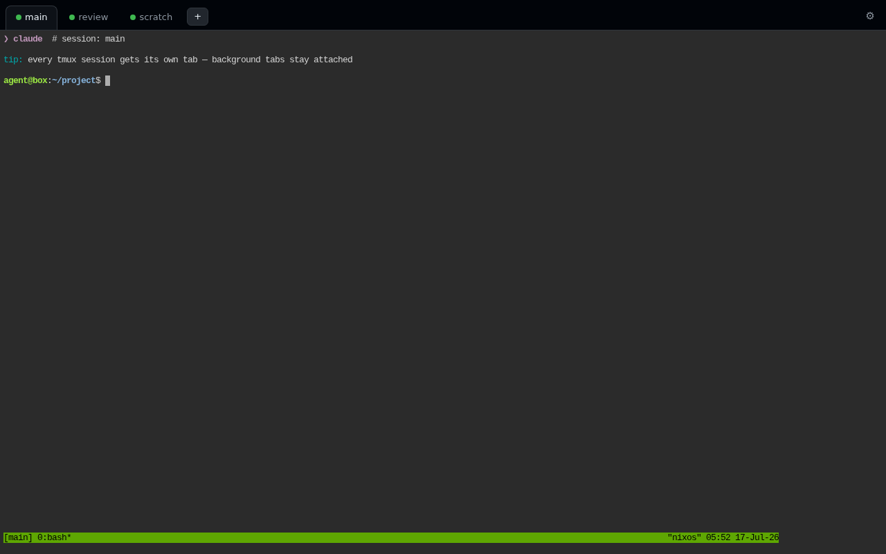

# agent-box

Reproducible, multi-user coding-agent sandboxes - one click on AWS, on bare
metal, or as a VM image, from one declarative config. (Built on NixOS.)

Each agent is an **unprivileged user** running a supported agent CLI inside a
persistent `tmux` session. The only elevated power an agent gets is a tight,
explicit passwordless-`sudo` allowlist. Custom tokens (e.g. `GH_TOKEN`) are
injected via drop-in `EnvironmentFile`s that never enter the world-readable Nix
store.

Supported agents:

| Agent | Package | Autonomy flag used by `skipPermissions = true` | Notes |
| --- | --- | --- | --- |
| Claude Code | `pkgs.claude-code` | `--dangerously-skip-permissions` | Supports Claude Remote Control. |
| Codex | `pkgs.codex` | `--dangerously-bypass-approvals-and-sandbox` | Browser terminal access; Codex app-server/remote wiring is future work. |

## 1-click AWS launch

Provisions one EC2 instance (NixOS 25.11) with the module + a browser terminal
(Caddy -> ttyd) already wired up. First load takes ~2-3 minutes while the AMI
provisions, `nixos-rebuild switch` applies the config, and Caddy issues a
Let's Encrypt cert against `<eip>.sslip.io`.

| Region | Launch |
| --- | --- |
| us-east-1 (N. Virginia) | [Launch stack →](https://console.aws.amazon.com/cloudformation/home?region=us-east-1#/stacks/quickcreate?stackName=agent-box&templateURL=https%3A%2F%2Fdefang-agent-box.s3.us-west-2.amazonaws.com%2Ftemplate.yaml) |
| us-west-2 (Oregon) | [Launch stack →](https://console.aws.amazon.com/cloudformation/home?region=us-west-2#/stacks/quickcreate?stackName=agent-box&templateURL=https%3A%2F%2Fdefang-agent-box.s3.us-west-2.amazonaws.com%2Ftemplate.yaml) |
| eu-central-1 (Frankfurt) | [Launch stack →](https://console.aws.amazon.com/cloudformation/home?region=eu-central-1#/stacks/quickcreate?stackName=agent-box&templateURL=https%3A%2F%2Fdefang-agent-box.s3.us-west-2.amazonaws.com%2Ftemplate.yaml) |
| eu-west-1 (Ireland) | [Launch stack →](https://console.aws.amazon.com/cloudformation/home?region=eu-west-1#/stacks/quickcreate?stackName=agent-box&templateURL=https%3A%2F%2Fdefang-agent-box.s3.us-west-2.amazonaws.com%2Ftemplate.yaml) |

Choose `Agent` (`claude` or `codex`), set a `WebPassword` (any 16&ndash;64
characters, including password-manager symbols), pick an instance size,
launch. The stack reports
CREATE_COMPLETE only after the box phones home from its first successful
rebuild — a first boot that goes wrong (issue 106 has one way) rolls the
stack back visibly instead of leaving a green stack with a dead URL. The agent runs as the
`UserName` linux user (default `agent`). The template creates its own
IPv6-enabled VPC/subnet so nothing on the account has to be pre-configured. The
stack Outputs show `https://<v6-or-v4>.sslip.io/<UserName>/` - open it, sign in
as the `UserName` with your `WebPassword`, complete the selected agent's
one-time sign-in, done. `<UserName>@<stack name>` is used as the Claude Remote
Control session name; rename the stack before launch if you want a friendlier
label in the Claude apps.

**Cost note (Feb-2024 AWS IPv4 pricing).** The default is **IPv6-only** to
avoid the ~$3.60/mo public-IPv4 charge that AWS bills for *every* public IPv4,
elastic or not. Works if your client has IPv6 connectivity (most consumer ISPs
in NA/EU do; corporate/coffee-shop nets often don't). If IPv6 isn't reachable
for you, set `PublicIpv4: true` at launch — allocates an EIP, adds $3.60/mo,
works everywhere. IPv6-only boxes still reach IPv4-only sites — notably
`github.com` — through a free public DNS64/NAT64 service
([nat64.net](https://nat64.net)), on by default. Traffic to IPv4-only hosts
transits the NAT64 operator's gateways (TLS and SSH stay end-to-end encrypted
and authenticated); set `Nat64: false` to opt out, at the price of the box
not reaching IPv4-only hosts.

Costs, all-in, running 24/7: the default is a **persistent Spot** instance
(`UseSpot`) — on a Spot interruption AWS stops and later restarts the *same*
instance, so the disk, IPv6 address, and TLS cert survive (a live tmux
session doesn't; RAM is lost on any stop). Spot for the default `t4g.medium`
(Graviton/aarch64, 2 vCPU / 4 GiB) is currently $0.018–0.024/hr across the
four launch regions — **~$16–20/mo** including the ~$2.40/mo default 30 GiB
gp3 root volume (`RootVolumeSize`). `t4g.small` on Spot lands around
**~$7–10/mo** all-in and works for a single light agent, though its 2 GiB is
tight during self-update rebuilds. Spot runs ~50–60% below on-demand for
these types (small Graviton instances don't see the deep 70–90% Spot
discounts); `UseSpot: false` gets you on-demand `t4g.medium` at ~$0.034/hr
(~$27/mo all-in). Networking is $0/mo in the default IPv6-only mode; with
`PublicIpv4: true` the Elastic IP adds ~$3.60/mo. Terminate the stack to
stop billing.

Out of disk anyway? Enlarge the volume from the EC2 console (Volumes ->
Modify) and reboot the instance — NixOS grows the partition and filesystem
on boot. The box also garbage-collects the nix store automatically.

**Root shell via SSM Session Manager.** The template ships no SSH key; the
browser terminal is an unprivileged `agent` user. For a root path onto the
box (e.g. to inspect `amazon-init` on a failed first boot, which is
journal-only and invisible to `get-console-output`), the default template
attaches an IAM instance profile with `AmazonSSMManagedInstanceCore`. Open
a shell via the AWS console (Systems Manager -> Session Manager) or
`aws ssm start-session --target <InstanceId>`, then `sudo -i`. This adds
one CAPABILITY_IAM checkbox to the Launch Stack form; opt out with
`EnableSsm=false` to skip it. See
[aws/README.md](./aws/README.md#root-access-via-ssm-session-manager) for
details.

**Changing the web password.** Open the settings page (the gear icon next to
the terminal), choose **Change password**, and enter the current password plus
the new password twice. The new password follows the launch-time 16&ndash;64
character policy. Saving replaces the root-owned password hash using Caddy's
recommended Argon2id algorithm, reloads Caddy,
and signs out every browser by rotating the authentication-cookie secret.

**Updating the box.** Click "Update box" on the settings page (the gear icon
next to your terminal; the card also shows the running agent-box rev, linked
to its GitHub commit), or ask the agent in its terminal to run
`sudo systemctl start agent-box-update.service` — a root oneshot (alongside
the caddy reload, the only sudo the agent holds) that fast-forwards the box
to this repo's latest master, advances the agent-CLI pin to the newest
nixos-unstable channel release (so `claude` / `codex` stay current even
though the box itself tracks a stable NixOS release), and runs
`nixos-rebuild switch`. Have the agent save its working context first: the
rebuild restarts changed agent services, which kills their running sessions.
Anything that is not a fast-forward of the running revision is refused.
Verifying releases against an offline signing key is tracked in
[issue 46](https://github.com/defangdevs/agent-box/issues/46).

Template source: [`aws/template.yaml`](./aws/template.yaml).
See [`aws/README.md`](./aws/README.md) for the region -> AMI refresh workflow
and the S3-hosting setup.

## Why

Turns a hand-tuned, single-user, bare-metal agent setup into something others
can stand up identically - either as per-person accounts on a shared host or as
disposable, snapshot-able KVM guests.

**Why not just a container?** Three properties containers don't give you:

- **Blast radius.** The 1-click path puts each team on a *real VM in their
  own AWS account* — a hypervisor boundary rather than a shared kernel, and
  no code, tokens, or transcripts leave their org. The whole box is
  disposable from the CloudFormation console.
- **Persistence and multi-tenancy.** This is a long-lived box, not an
  ephemeral sandbox: agents keep working in persistent tmux sessions while
  you're away, state survives reconnects and reboots, and several people (or
  several agents per person) share one host under separate unprivileged
  accounts with systemd-hardened services — see the security model below.
- **One config, three targets.** The same declarative NixOS module produces
  the cloud box, the bare-metal multi-user host, and the qcow2 VM image,
  and a deployed box can fast-forward itself to this repo's latest release
  on request — no image rebuild pipeline.

## Quick start (bare metal, multiple users)

Add the flake as an input and import the module:

```nix
# flake.nix (your host)
{
  inputs.agent-box.url = "github:defangdevs/agent-box";
  # ...
}
```

```nix
# configuration.nix
{ pkgs, ... }:
{
  imports = [ inputs.agent-box.nixosModules.agent-box ];

  services.agent-box = {
    enable = true;
    agent = "claude"; # or "codex"
    users = {
      # One account, several agents: sessions seed on FIRST BOOT only —
      # afterwards add/remove them at runtime (see "Sessions" below).
      alice = {
        sessions = {
          main   = { };                    # box default agent
          review = { agent = "codex"; };
        };
      };
      bob   = { remoteControlName = "bob-box"; };
      coder = { agent = "codex"; };
      ci    = { skipPermissions = false; };   # keep approval prompts on
    };
    # The ONLY elevated powers the agents get - keep it tight.
    sudoAllowlist = [ "/run/current-system/sw/bin/systemctl reload caddy.service" ];
    extraPackages = with pkgs; [ git ripgrep jq ];
  };
}
```

Then `sudo nixos-rebuild switch`. Each user gets an `agent-box-<name>.service`.

**First login (per user):** attach to the session and complete the one-time
agent sign-in:

```bash
sudo -u alice env TMUX_TMPDIR=/run/agent-box-alice tmux -L agent-box attach -t main
```

`TMUX_TMPDIR` is required: the agent service runs with `PrivateTmp`, so its
tmux control socket lives under `/run/agent-box-<user>` rather than `/tmp`.

Credentials live in that user's home directory (`~/.claude` for Claude Code,
`~/.codex` for Codex) - per-user runtime state, never baked into the config.

Sign-in is the *only* interactive step: the module pre-accepts Claude Code's
other first-run dialogs (the folder-trust prompt for the agent's working
directory, and the Bypass Permissions warning when `skipPermissions` is on)
by seeding the acceptance flags into `~/.claude.json` and
`~/.claude/settings.json` before each start. Without that, a fresh box parks
the session on a dialog that Remote Control can't answer.

**Claude Code first login in the browser terminal:** Claude emits its OAuth URL
as an OSC 8 hyperlink with the complete URL in a hidden target. The terminal's
`xterm-256color` terminfo cannot advertise OSC 8, so agent-box explicitly
enables tmux's `hyperlinks` client feature. Without it tmux redraws only the
visible text; Safari then detects just the first wrapped row as a plain URL and
opens that truncated fragment. With the native OSC 8 target forwarded, clicking
the first row opens the complete URL even when the visible text wraps.

Claude Code 2.1.126 and later accepts the returned OAuth code in the terminal
when the browser cannot reach a local callback (see the
[Claude Code changelog](https://github.com/anthropics/claude-code/blob/main/CHANGELOG.md)),
so no callback relay is needed. If an older deployed box still shows the
legacy flow, update it from the settings page or run
`sudo systemctl start agent-box-update.service`, then retry
`claude auth login`.

The auth code input is hidden like a password, so pasting gives no visible
feedback. Paste the code, press Enter, and Claude Code should print
`Login successful.`.

## Sessions (any user can run any agent — no rebuild)

A linux user account and an agent CLI are decoupled: each user runs one or
more **sessions**, and each session is one agent (Claude Code or Codex) in
its own tmux session, all supervised by that user's single hardened
`agent-box-<name>.service`. All supported agent CLIs are installed
regardless of what any session runs (`installAgents`). The pseudo-agent
`shell` runs the user's login shell instead — a supervised plain terminal
for manual investigation or clean-up that respawns on exit and gets a
terminal tab in the web workspace like any other session.

Sessions are **runtime data**. The Nix config above only seeds
`~/.config/agent-box/sessions.json` on first boot; after that the file is
authoritative and a rebuild never clobbers runtime changes. Create and
destroy sessions as the user — no sudo, no `nixos-rebuild`:

```bash
agent-box-session ls                        # NAME AGENT STATE
agent-box-session add review --agent codex  # starts within ~2s
agent-box-session add scratch --cwd ~/proj -- --model opus
agent-box-session add tidy --agent shell    # plain login shell, no agent
agent-box-session restart review
agent-box-session rm review                 # delist + kill
```

The site root (web setups) is the terminal itself — `https://<domain>/` is
a tabbed workspace, one tab per session, behind the same login as the
terminal (add sessions from the tab bar; restart/delete on the settings
page) — and agents can spawn sibling sessions themselves (it's just a file
edit on their own account — handy for "have Codex cross-check this").



Attach locally with `tmux -L agent-box attach -t <session>` (see
`TMUX_TMPDIR` note above). In the browser, every tab is also a
deep-linkable standalone terminal at
`https://<domain>/<user>/?arg=<session>`. Killed-on-error sessions keep a
post-mortem shell open instead of being respawned over; delisted sessions
stay gone.

## VM image

Build from the same config:

```bash
nix build github:defangdevs/agent-box#vm   # -> qcow2 disk image
# or run a throwaway QEMU VM locally:
nixos-rebuild build-vm --flake github:defangdevs/agent-box#vm && ./result/bin/run-*-vm
```

The bundled `hosts/vm.nix` provisions a single `agent` user with console
autologin (change the initial password on first boot).

## Adding custom tokens (no rebuild)

Each agent auto-loads `/etc/agent-box/<user>.env` if it exists. Drop a token in
and restart the unit:

```bash
sudo install -m600 /dev/stdin /etc/agent-box/alice.env <<'EOF'
GH_TOKEN=ghp_xxx
EOF
sudo systemctl restart agent-box-alice
```

The file is read by systemd as root and exported into the agent's environment,
so secrets stay out of the Nix store. For Nix-managed secret paths (agenix,
sops-nix, etc.) use `environmentFiles` instead.

## Options

All under `services.agent-box`:

| Option | Default | Description |
| --- | --- | --- |
| `enable` | `false` | Turn the module on. |
| `agent` | `"claude"` | Default agent CLI: `"claude"` or `"codex"`. |
| `package` | selected agent default | Override package to run for every agent user. |
| `installAgents` | all supported | Agent CLIs installed on the box (independent of what sessions run). |
| `users.<name>.sessions.<s>.*` | `{}` | Seed sessions (first boot only): per session `agent`, `skipPermissions`, `remoteControl`, `remoteControlName`, `workingDirectory`, `extraArgs`. Empty = the legacy per-user options below seed a session named `main`. |
| `users.<name>.agent` | `null` | Agent for the default `main` session; null uses `services.agent-box.agent`. |
| `users.<name>.skipPermissions` | `true` | Pass the selected agent's autonomy flag. |
| `users.<name>.remoteControl` | `true` | Pass Claude's `--remote-control` when `agent = "claude"`; ignored for Codex. |
| `users.<name>.remoteControlName` | `<name>@<host>` | Claude Remote Control session name (null -> `<user>@<fqdnOrHostName>` for `main`, `<user>-<session>@<fqdnOrHostName>` for other sessions). Ignored for Codex. |
| `users.<name>.workingDirectory` | `/home/<name>` | Agent startup directory. |
| `users.<name>.extraGroups` | `[]` | Extra groups for the user. |
| `users.<name>.extraArgs` | `[]` | Extra args appended to the selected agent CLI. |
| `users.<name>.environmentFiles` | `[]` | Extra `EnvironmentFile` paths for this agent. |
| `users.<name>.environment` | `{}` | Extra (non-secret) env vars for this agent's service. |
| `sudoAllowlist` | `[]` | Passwordless sudo commands granted to every agent. |
| `extraPackages` | `[]` | Packages placed on each agent's PATH. |
| `environmentFiles` | `[]` | Extra `EnvironmentFile` paths applied to every agent. |
| `tokenDir` | `/etc/agent-box` | Where per-agent `<user>.env` token files live. |
| `manageTokenDir` | `true` | Create `tokenDir` (root-owned) via tmpfiles. |
| `protectMemory` | `true` | zram swap (zstd, sized to RAM), earlyoom, and `OOMScoreAdjust=500` on agent units, so runaway agent memory gets its process killed (and auto-restarted) instead of livelocking the whole box. All knobs are `mkDefault` - tune or disable pieces from the host config. |

## Security model

The module treats each agent as an untrusted process running inside its own
unprivileged user account, on a machine the operator already treats as a
sandbox host (VM, throwaway EC2 box, etc.). The OS layer is what contains a
compromised agent - the agent CLI's in-tool approval prompts are *deliberately*
off by default (`skipPermissions = true`), so nothing in the agent itself gates
arbitrary command execution as the agent user.

**What the module gives you:**

- **Unprivileged agent user.** Not root. Agent autonomy is intentionally scoped
  to that user.
- **Systemd hardening on every agent service:** `PrivateTmp`,
  `PrivateDevices` (keeps pty, blocks `/dev/mem` and friends),
  `ProtectSystem=strict` (root filesystem read-only, only `/home/<name>`
  writable via `ReadWritePaths`), `ProtectKernelTunables/Modules/`
  `ControlGroups/Clock`, `RestrictSUIDSGID`, `RestrictRealtime`,
  `LockPersonality`. `NoNewPrivileges=true` is applied automatically when
  `sudoAllowlist` is empty; a non-empty allowlist keeps NNP off (sudo is
  setuid and needs the euid transition) - a deliberate trade of a bit of
  containment for scoped elevation.
- **Tight sudo:** whatever's in `sudoAllowlist` is the entire root-capable
  surface. `NOPASSWD` only - no `SETENV`, no blanket sudo, no ALL.
- **Nothing anonymous, brute-force damping (web deployments):** every path
  on the vhost — terminal workspace, per-session terminals, settings — sits
  behind the
  login (the CI tests assert the 401s), new password hashes use Caddy's
  recommended Argon2id algorithm (legacy bcrypt hashes remain accepted until
  the password changes), and a fail2ban jail bans IPs that repeatedly fail it
  (default on, `web.fail2ban`; it only counts requests that actually carried
  credentials). Discovery isn't assumed to be hard — the ACME cert for
  `<ip>.sslip.io` lands in public CT logs minutes after launch — auth is
  simply required everywhere.
- **Root-scoped secrets dir:** `/etc/agent-box` is `0700 root:root`.
  Systemd reads the per-agent `<user>.env` files as root before dropping
  into the agent's UID, so the agent process itself never traverses the
  directory. `Z … 0600 root root` tmpfiles rule enforces the mode of any
  file inside on every rebuild.

**Deliberate defaults that stay ON:**

- `skipPermissions = true` - a headless agent runner with per-tool
  approval prompts and no human to answer them is useless. Flip to
  `false` per-user if you actually have a human at the terminal.
- `remoteControl = true` - for Claude Code, this is the "drive it from your
  phone" feature. Flip to `false` per-user if you don't want the session
  reachable from the Claude apps. Codex ignores this option.

**Tradeoffs the module can't fully paper over:**

- **Persistent `/home/<name>` across sessions.** SSH keys, git creds,
  dotfiles, session state - anything the agent writes accumulates.
  Treat each agent home as untrusted; back up or wipe with intent.
- **Secrets as env vars.** Anything in `<user>.env` becomes an env
  var in the agent's process and its children. Env vars can leak via
  `/proc/<pid>/environ`, coredumps, or child-process inheritance.
  Systemd's `LoadCredential=` (files under `$CREDENTIALS_DIRECTORY`)
  is a possible future improvement if the tools running under the
  agent actually read from there.
- **A prompt-injected agent can spend whatever you gave it.** Everything
  the agent user can read — env tokens, `~/.ssh`, logged-in CLIs — it can
  also use or exfiltrate if hostile content it processes (a web page, an
  issue, a dependency README) hijacks it. No sandbox changes that; it only
  contains the damage to what those credentials allow. Scope tokens to the
  repos and roles the agent actually needs, and size each key by what it
  could do in an attacker's hands.
- **Agent autonomy flags** grant full autonomy inside the agent CLI. Prefer the
  VM target for anything you'd not lose sleep over an attacker doing as the
  agent user - a KVM guest is a
  much stronger blast-radius boundary than a container.

## Notes

- `claude-code` is unfree; the module allows just the supported agent packages
  (overridable).
- The qcow2 image uses the native nixpkgs image API (`system.build.images`,
  upstreamed in NixOS 25.05) - no extra flake inputs.
- Future work: switching the agent on a running instance should likely be a
  small NixOS config change (`services.agent-box.agent = ...`) plus
  `nixos-rebuild switch` and a service restart, but the UX still needs a tidy
  operator command because credentials and live tmux state are agent-specific.

## Docs

Maintainer and continuity notes live in the
[project wiki](https://github.com/defangdevs/agent-box/wiki).

## License

MIT - see [LICENSE](./LICENSE). Note this license covers the flake/module only;
agent CLIs ship under their own terms.
